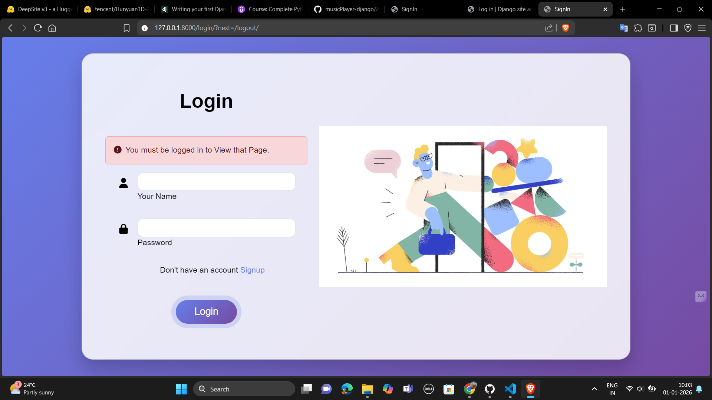
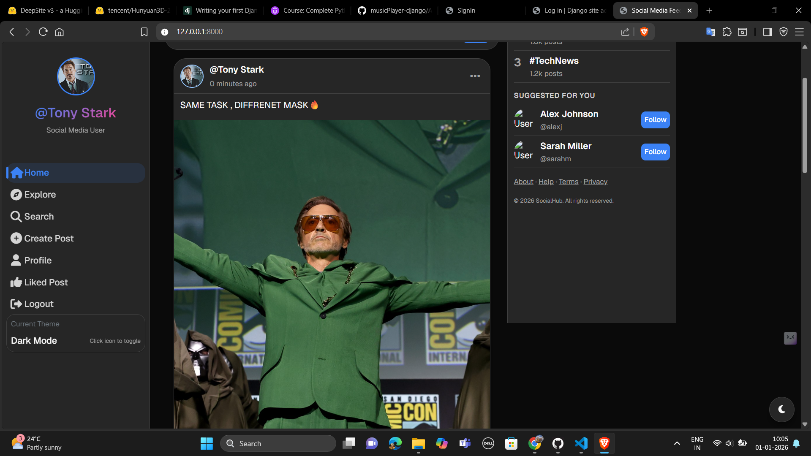
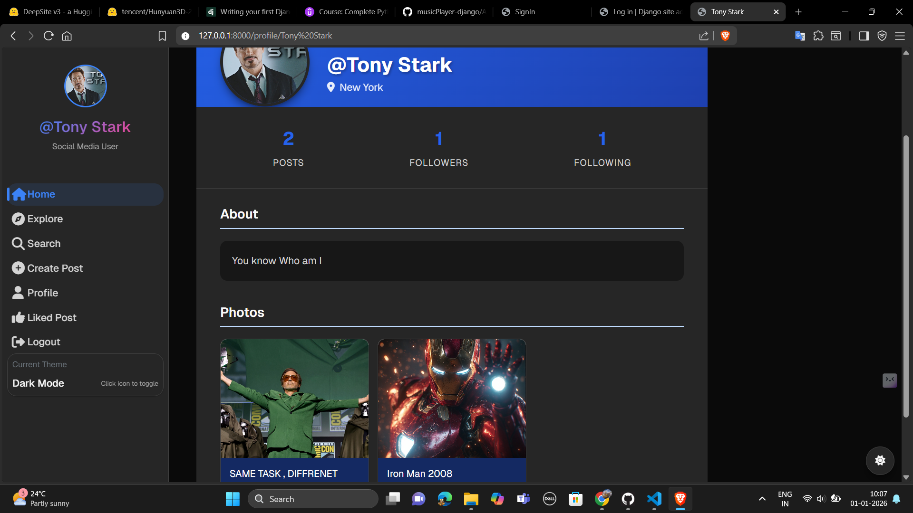

# 🌐 Socialyze – A Django-Based Social Media Platform(Social + Energize)

Socialyze is a full-stack **social media web application** built using **Django**.  
It allows users to connect, share posts, follow/unfollow others, like posts, comment, and search profiles or content — similar to modern social networking platforms.

This project was developed to strengthen my **backend development skills**, understand **real-world social media features**, and implement **clean Django architecture**.

---

## 🚀 Features

- 🔐 User Authentication (Signup / Login / Logout)
- 👤 User Profile Management  
  - Profile image  
  - Bio & location update  
- 📝 Create, edit & delete posts
- ❤️ Like & Unlike posts
- 💬 Comment system (dynamic toggle)
- ➕ Follow / Unfollow users
- 🔍 Search users by username
- 🔎 Search posts by caption
- 📊 Followers & Following count
- 🖼 Media upload support
- 🎨 Responsive & modern UI

---

## 🛠 Tech Stack

**Frontend**
- HTML5
- CSS3
- JavaScript

**Backend**
- Python
- Django

**Database**
- SQLite (can be upgraded to MySQL/PostgreSQL)

---

## 📸 Screenshots

### 🔐 Login Page

### 🏠 Home Feed

### 👤 User Profile

### 🔍 Search Page

### 💬 Comment Section

---

